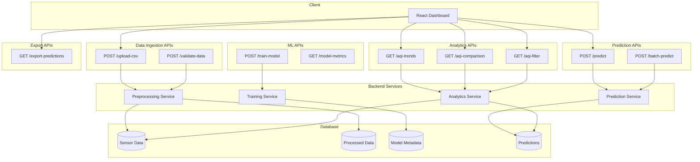

# API Contract Diagram



---

# API Request / Response Contracts

## Upload Dataset

### POST /upload-csv

**Request**

```json
{
  "file": "sensor_data.csv"
}
```

**Response**

```json
{
  "status": "success",
  "message": "Dataset uploaded successfully"
}
```

---

## Validate Dataset

### POST /validate-data

**Response**

```json
{
  "missing_values": true,
  "timestamp_valid": true,
  "schema_valid": true
}
```

---

## Train Model

### POST /train-model

**Response**

```json
{
  "status": "training_started"
}
```

---

## Get Model Metrics

### GET /model-metrics

**Response**

```json
{
  "rmse": 12.4,
  "mae": 8.7,
  "r2_score": 0.81
}
```

---

## Real-time Prediction

### POST /predict

**Request**

```json
{
  "co": 2.3,
  "nox": 120,
  "no2": 80,
  "temperature": 28,
  "humidity": 65,
  "timestamp": "2026-02-24T10:00:00"
}
```

**Response**

```json
{
  "predicted_aqi": 145,
  "confidence": 0.87,
  "timestamp": "2026-02-24T10:00:00"
}
```

---

## Batch Prediction

### POST /batch-predict

**Request**

```json
{
  "records": [ ... ]
}
```

**Response**

```json
{
  "predictions": [ ... ]
}
```

---

## AQI Trends

### GET /aqi-trends

**Response**

```json
{
  "trend": [ ... ]
}
```

---

## AQI Comparison

### GET /aqi-comparison

**Response**

```json
{
  "actual": [ ... ],
  "predicted": [ ... ]
}
```

---

## Filter AQI Data

### GET /aqi-filter

**Query Params**

```
?start_date=2026-02-01
&end_date=2026-02-10
&pollutant=no2
```

---

## Export Predictions

### GET /export-predictions

**Response**

```
CSV File
```

---
