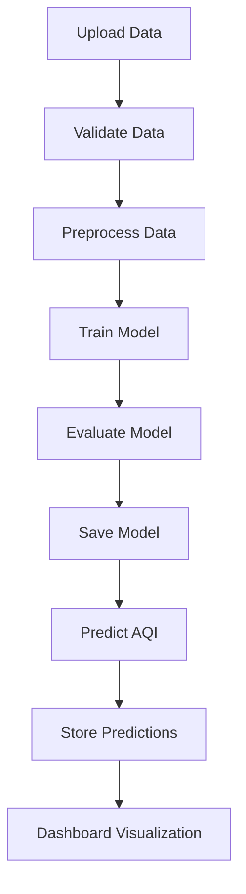

📄  **Feature Breakdown and API Planning**

---

# 🌫️ AQI Prediction System – Feature Breakdown & API Planning

---

## 1. Feature Breakdown

### ✅ Core Features (Must-Have)

#### 📦 Data Layer

* CSV Upload (Sensor Dataset)
* Batch Data Ingestion
* Data Validation

  * Handle `-200` missing values
  * Format checks
* Timestamp Processing
  *(Merge date + time)*

---

#### 🤖 ML Layer

* Data Preprocessing
* Feature Selection
* Time-based Train-Test Split
* Random Forest Model Training
* Model Evaluation

  * RMSE
  * MAE
  * R²
* Model Saving (`.pkl`)

---

#### 🔮 Prediction Layer

* Real-time AQI Prediction API
* Batch Prediction Support
* Store Predictions in DB

---

#### 📊 Dashboard Layer

* Actual vs Predicted AQI
* Trend Visualization
* Pollutant Filters
* Date Range Filters

---

#### 📤 Output Layer

* Export Prediction CSV

---

### 🚀 Stretch Features (Optional)

* Multi-step AQI Forecasting (6–24 hrs)
* Model Comparison (XGBoost etc.)
* Auto Retraining
* AQI Alert System
* Heatmap Visualization
* Role-Based Access
* Anomaly Detection

---

## 2. API Planning

### 📥 Data Ingestion APIs

#### Upload Dataset

```
POST /upload-csv
```

Uploads sensor dataset

#### Validate Dataset

```
POST /validate-data
```

Checks:

* Missing values (`-200`)
* Schema
* Timestamp integrity

---

### 🧠 ML APIs

#### Train Model

```
POST /train-model
```

Triggers:

* Preprocessing
* Feature Engineering
* Model Training

#### Get Model Metrics

```
GET /model-metrics
```

Returns:

* RMSE
* MAE
* R²

---

### 🔮 Prediction APIs

#### Real-time Prediction

```
POST /predict
```

**Input:**

* Pollutant values
* Environmental values
* Timestamp

**Output:**

* Predicted AQI
* Confidence

---

#### Batch Prediction

```
POST /batch-predict
```

---

### 📊 Dashboard APIs

#### Get AQI Trends

```
GET /aqi-trends
```

#### Get Actual vs Predicted

```
GET /aqi-comparison
```

#### Filter Data

```
GET /aqi-filter
```

**Params:**

* Date range
* Pollutant type

---

### 📤 Export API

```
GET /export-predictions
```

---

## 3. Database Entity Identification

### 🧾 1. Sensor_Data

Stores raw uploaded readings

| Field        | Type      |
| ------------ | --------- |
| id           | UUID      |
| timestamp    | DATETIME  |
| CO           | FLOAT     |
| NMHC         | FLOAT     |
| NOx          | FLOAT     |
| NO₂          | FLOAT     |
| C6H6         | FLOAT     |
| temperature  | FLOAT     |
| humidity     | FLOAT     |
| abs_humidity | FLOAT     |
| created_at   | TIMESTAMP |

---

### 🧹 2. Processed_Data

After cleaning & feature engineering

| Field            | Type      |
| ---------------- | --------- |
| id               | UUID      |
| sensor_data_id   | FK        |
| cleaned_flag     | BOOLEAN   |
| lag_features     | JSON      |
| rolling_features | JSON      |
| created_at       | TIMESTAMP |

---

### 🧠 3. Model_Metadata

| Field         | Type      |
| ------------- | --------- |
| id            | UUID      |
| model_version | TEXT      |
| algorithm     | TEXT      |
| rmse          | FLOAT     |
| mae           | FLOAT     |
| r2_score      | FLOAT     |
| trained_at    | TIMESTAMP |
| model_path    | TEXT      |

---

### 🔮 4. Predictions

| Field          | Type      |
| -------------- | --------- |
| id             | UUID      |
| timestamp      | DATETIME  |
| predicted_aqi  | FLOAT     |
| model_version  | FK        |
| input_features | JSON      |
| created_at     | TIMESTAMP |

---

### 📉 5. AQI_Logs

For dashboard tracking

| Field         | Type      |
| ------------- | --------- |
| id            | UUID      |
| actual_aqi    | FLOAT     |
| predicted_aqi | FLOAT     |
| deviation     | FLOAT     |
| recorded_at   | TIMESTAMP |

---

### 👤 6. Users *(Optional – if role-based access added)*

| Field      | Type      |
| ---------- | --------- |
| id         | UUID      |
| role       | TEXT      |
| email      | TEXT      |
| created_at | TIMESTAMP |

---

## 4. Final System Flow

*(Based on diagram on page 8)* 



---

